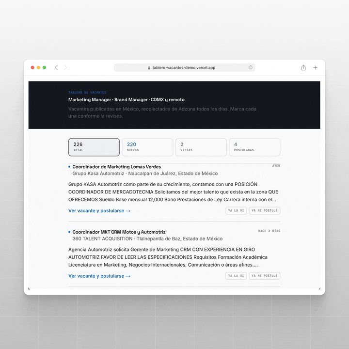
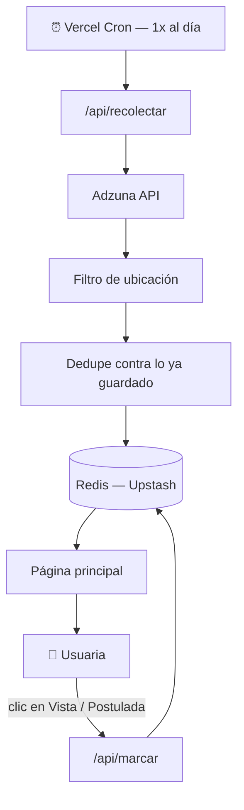

<h1 align="center" style="margin:0;">
  <picture>
    <source media="(prefers-color-scheme: dark)" srcset="media/logo/logo.svg">
    <source media="(prefers-color-scheme: light)" srcset="media/logo/logo-oscuro.svg">
    
  </picture>
</h1>

<h3 align="center" style="margin: 0; margin-top: 0;">
Tablero personal que recolecta vacantes automáticamente, todos los días, y avisa solo lo nuevo.
</h3>

---

<p align="center">
  
</p>

Tablero web que recolecta vacantes automáticamente desde una API pública de empleo, las deduplica, y las publica en una página donde se pueden marcar como **vista** o **postulada**, con el estado guardado entre visitas y dispositivos.

Nace para un puesto y ciudad específicos (Marketing/Brand Manager, CDMX), pero está construido para replicarse con cualquier otro puesto o industria cambiando solo la configuración de búsqueda.

**Demo pública:** https://tablero-vacantes-demo.vercel.app — busca tu propio puesto y ciudad, en vivo contra Adzuna. Es una versión ligera a propósito: sin cron ni base de datos compartida, tus marcas de "vista"/"postulada" se guardan solo en tu navegador. El tablero real (privado, con datos de una sola usuaria) vive en otra URL protegida con contraseña.

---

## Decisiones de diseño

**API pública, no scraping.** Leer el HTML de LinkedIn/Indeed con un bot es frágil (se rompe con cada rediseño del sitio) y legalmente gris. Se eligió [Adzuna](https://developer.adzuna.com/) porque, además de tener cobertura real en México, expone un endpoint de solo-conteo, permite sondear cuántos resultados reales existen con una configuración de búsqueda *antes* de comprometerse a ella, sin gastar cuota de prueba y error.

**Se diseñó con datos de muestra antes de conectar la API real.** La interfaz se construyó y se validó visualmente primero (tarjetas, colores, el toggle de "vista"/"postulada"), sin depender de que Adzuna, Redis o Vercel ya existieran. Eso separa "¿se ve bien?" de "¿ya conecta de verdad?" y evita gastar cuota de API en cada recarga mientras se itera el diseño.

**Actualización optimista.** Marcar una vacante como "vista" o "postulada" se siente instantáneo: la UI cambia antes de esperar la confirmación del servidor, y revierte sola si el guardado falla.

**Un tablero, no un producto multiusuario — resuelto con dos deploys, no con un sistema de cuentas.** Nació pensado para una sola persona (mi pareja), sin login ni separación por usuario: cualquiera con la URL ve y marca las mismas vacantes. Eso funcionaba bien hasta que el link de este mismo README apuntó a esa URL real — cualquiera que leyera el repo podía pisar sus marcas. La solución no fue construir autenticación multiusuario para un caso de uso de una sola persona: el tablero real quedó protegido con una contraseña simple (`proxy.ts`, activo solo si existe la variable `SITE_PASSWORD`), y el link público de este README apunta a un segundo proyecto — el demo de arriba — con su propia cuota de Adzuna, sin Redis y sin cron, donde cada quien busca lo suyo y sus marcas viven solo en su navegador.

> [!TIP]
> **¿Y si alguien clona este repo?** Puede leer y modificar el código en su copia local, pero no puede correrlo contra los datos reales: las credenciales de Redis y Adzuna nunca están en el repo (viven solo como variables de entorno en Vercel). Para que le funcione de verdad, necesitaría su propia cuenta de Vercel, su propio Redis y sus propias llaves de Adzuna, lo que le daría su propio tablero, aislado del mío, no acceso al mío.

---

## Cómo funciona



Un cron diario llama a la [API de Adzuna](https://developer.adzuna.com/), filtra por ubicación (usando la jerarquía estructurada de zona geográfica que la propia API expone, no texto libre), deduplica contra lo que ya se guardó, y persiste en Redis. La página lee de ahí, no llama a la API externa en cada visita, y cada marca de "vista"/"postulada" se guarda en el mismo lugar, con actualización optimista en la UI.

Antes de comprometerme a esta configuración de búsqueda, hice un sondeo de volumen (llamadas baratas de solo-conteo) para confirmar cuántos resultados reales existían con distintas combinaciones de parámetros, ver `scripts/sondeo-volumen.mjs`.

## Stack

- **[Next.js](https://nextjs.org/)** (App Router) + **Tailwind CSS v4**
- **[Adzuna API](https://developer.adzuna.com/)** como fuente de vacantes
- **Redis** ([Upstash](https://upstash.com/), vía el Marketplace de Vercel) + [`@upstash/redis`](https://www.npmjs.com/package/@upstash/redis) para persistencia
- **[Vercel Cron](https://vercel.com/docs/cron-jobs)** para la recolección automática diaria
- Desplegado en **[Vercel](https://vercel.com/)**

## Modelo de datos (Redis)

```
vacante:{id}          → hash con { titulo, empresa, ubicacion, descripcion, fecha, url, vista, postulada }
ids_conocidos          → set con todos los ids ya guardados (dedupe)
vacantes_por_fecha     → sorted set: id → fecha (para leer ya ordenado, sin ordenar en cada visita)
```

## Configuración local

```bash
npm install
```

Variables de entorno (`.env.local`):

| Variable | De dónde sale |
|---|---|
| `ADZUNA_APP_ID` / `ADZUNA_APP_KEY` | Registrando una aplicación en [developer.adzuna.com](https://developer.adzuna.com/) |
| `KV_REST_API_URL` / `KV_REST_API_TOKEN` | Se generan solas al conectar Redis desde el Marketplace de Vercel (Storage → Marketplace → Redis) |
| `CRON_SECRET` | Un valor aleatorio propio (`openssl rand -hex 32`) — Vercel Cron lo manda como header `Authorization` en cada llamada automática |
| `SITE_PASSWORD` | Opcional — solo el deploy real la define. Si existe, `proxy.ts` exige login antes de ver el tablero; si no existe (como en el demo), no hay gate |
| `DEMO_MODE` | Opcional — solo el deploy demo la define como `1`. Cambia `/` por el formulario de búsqueda en vivo (`app/DemoHome.tsx`), sin leer ni escribir Redis |

```bash
npm run dev       # desarrollo local — http://localhost:3000
npm run build     # build de producción
```

## Deploy

```bash
vercel link       # conecta esta carpeta a un proyecto de Vercel
vercel --prod     # deploy a producción
```

El cron (`vercel.json`) se registra solo en cada deploy — no requiere configuración aparte en el dashboard.

## Personalizar para otro puesto o industria

1. Cambia los términos de búsqueda y la ubicación en `lib/adzuna.ts`.
2. Si es la misma cuenta de Adzuna, las mismas llaves sirven.
3. Usa un namespace/prefijo distinto en Redis (o un proyecto de Vercel separado) para no mezclar los ids de dos búsquedas distintas.

## Límites conocidos

- Adzuna no separa "requisitos" de "descripción", es un solo campo de texto truncado.
- La detección de vacantes remotas depende de que el título o la descripción lo mencionen explícitamente (la API no trae una bandera estructurada para esto).

## Licencia

© 2026 Daniel Osuna. Código de portafolio, se puede ver y evaluar, no reusar sin permiso.
