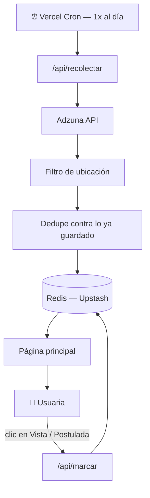

# Tablero de Vacantes

Tablero web que recolecta vacantes automáticamente desde una API pública de empleo, las deduplica, y las publica en una página donde se pueden marcar como **vista** o **postulada** — con el estado guardado entre visitas y dispositivos.

Nace para un puesto y ciudad específicos (Marketing/Brand Manager, CDMX), pero está construido para replicarse con cualquier otro puesto o industria cambiando solo la configuración de búsqueda.

**Demo en producción:** https://tablero-vacantes-marketing.vercel.app

---

## Cómo funciona



Un cron diario llama a la [API de Adzuna](https://developer.adzuna.com/), filtra por ubicación (usando la jerarquía estructurada de zona geográfica que la propia API expone, no texto libre), deduplica contra lo que ya se guardó, y persiste en Redis. La página lee de ahí — no llama a la API externa en cada visita — y cada marca de "vista"/"postulada" se guarda en el mismo lugar, con actualización optimista en la UI.

Antes de comprometerse a esta configuración de búsqueda, se hizo un sondeo de volumen (llamadas baratas de solo-conteo) para confirmar cuántos resultados reales existían con distintas combinaciones de parámetros — ver `scripts/sondeo-volumen.mjs`.

## Stack

- **[Next.js](https://nextjs.org/)** (App Router) + **Tailwind CSS v4**
- **[Adzuna API](https://developer.adzuna.com/)** como fuente de vacantes
- **Redis** ([Upstash](https://upstash.com/), vía el Marketplace de Vercel) + [`@upstash/redis`](https://www.npmjs.com/package/@upstash/redis) para persistencia
- **[Vercel Cron](https://vercel.com/docs/cron-jobs)** para la recolección automática diaria
- Desplegado en **[Vercel](https://vercel.com/)**

## Modelo de datos (Redis)

```
vacante:{id}          → hash con { titulo, empresa, ubicacion, descripcion, fecha, url, vista, postulada }
ids_conocidos          → set con todos los ids ya guardados (dedupe)
vacantes_por_fecha     → sorted set: id → fecha (para leer ya ordenado, sin ordenar en cada visita)
```

## Configuración local

```bash
npm install
```

Variables de entorno (`.env.local`):

| Variable | De dónde sale |
|---|---|
| `ADZUNA_APP_ID` / `ADZUNA_APP_KEY` | Registrando una aplicación en [developer.adzuna.com](https://developer.adzuna.com/) |
| `KV_REST_API_URL` / `KV_REST_API_TOKEN` | Se generan solas al conectar Redis desde el Marketplace de Vercel (Storage → Marketplace → Redis) |
| `CRON_SECRET` | Un valor aleatorio propio (`openssl rand -hex 32`) — Vercel Cron lo manda como header `Authorization` en cada llamada automática |

```bash
npm run dev       # desarrollo local — http://localhost:3000
npm run build     # build de producción
```

## Deploy

```bash
vercel link       # conecta esta carpeta a un proyecto de Vercel
vercel --prod     # deploy a producción
```

El cron (`vercel.json`) se registra solo en cada deploy — no requiere configuración aparte en el dashboard.

## Personalizar para otro puesto o industria

1. Cambia los términos de búsqueda y la ubicación en `lib/adzuna.ts`.
2. Si es la misma cuenta de Adzuna, las mismas llaves sirven.
3. Usa un namespace/prefijo distinto en Redis (o un proyecto de Vercel separado) para no mezclar los ids de dos búsquedas distintas.

## Límites conocidos

- Adzuna no separa "requisitos" de "descripción" — es un solo campo de texto truncado.
- La detección de vacantes remotas depende de que el título o la descripción lo mencionen explícitamente (la API no trae una bandera estructurada para esto).
